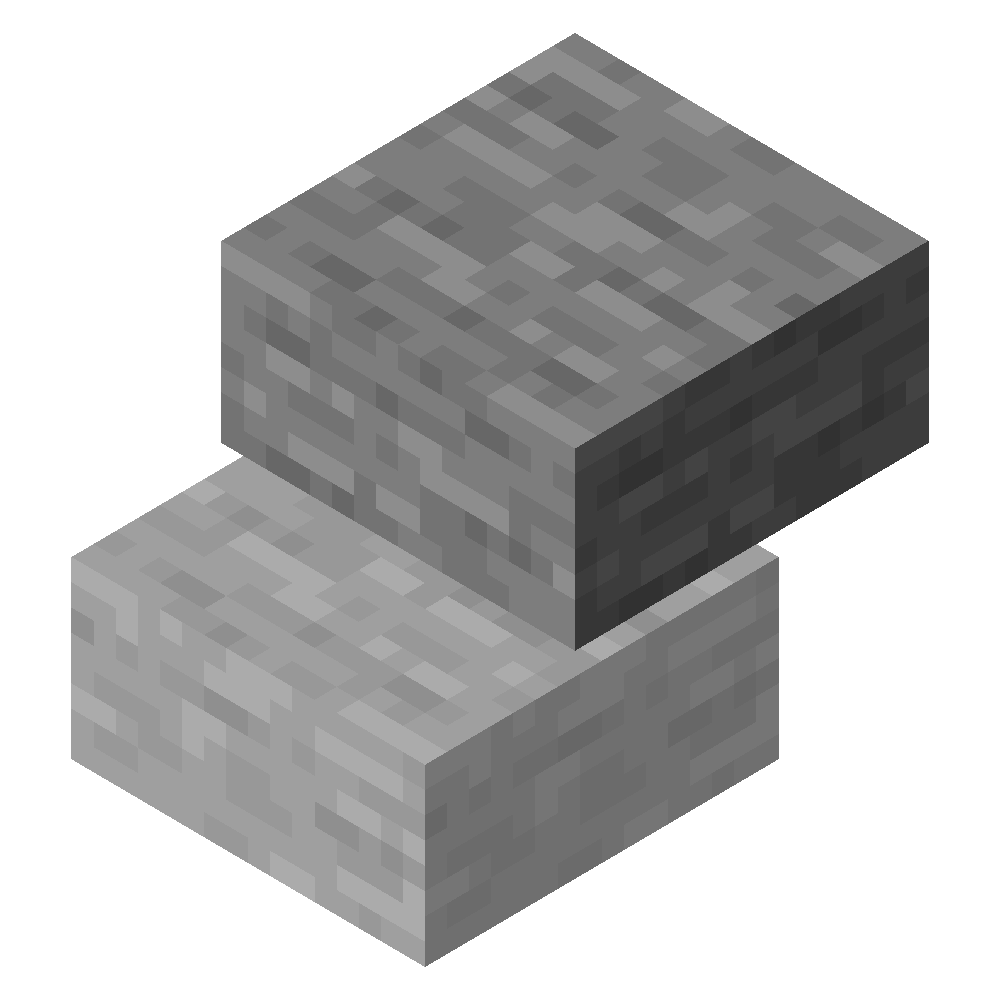

<h3 align="center">
   
  <h2 align="center">Slab Placement</h2>
  
Fabric mod to force placing top or bottom slabs only 

</h3>

### About
This mod makes it easier for Redstoners to place top slabs. By pressing U (or another keybind) it will switch between placing top slabs, placing bottom slabs, and default behaviour.

### Building
- Clone the repository
- `./gradlew build` (Linux/macOS/BSD) or `gradlew.bat build` (Windows)
- Output will be in `build/libs/` named `SlabPlacement-<version>.jar`

